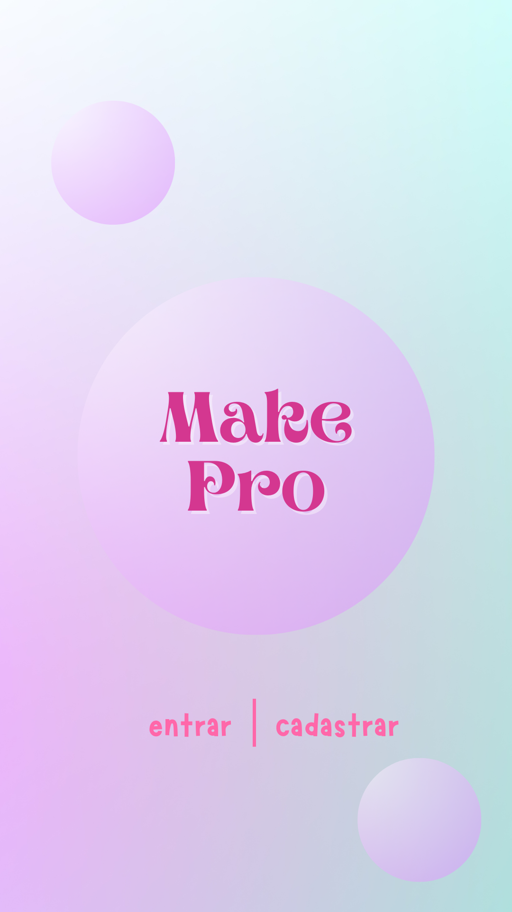
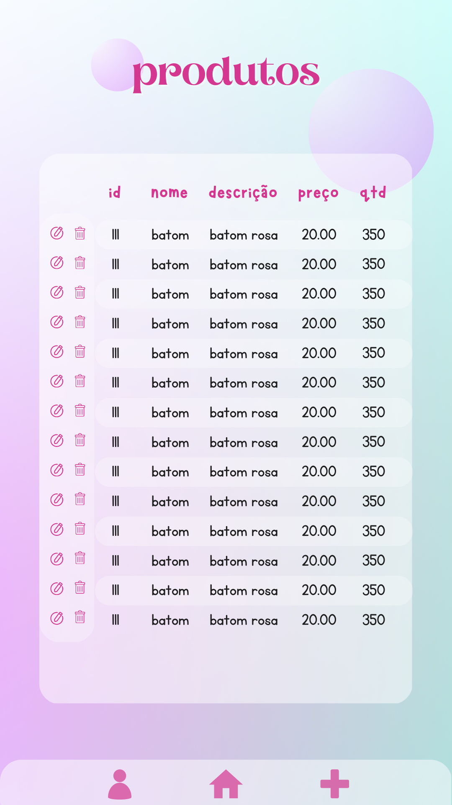

# Desafio Integrador Trimestral

### Contexto
Uma startup que vende produtos de beleza online está crescendo rapidamente e precisa de um novo sistema para gerenciar os pedidos dos clientes e o estoque de produtos.

### 1# Implantação de Sistemas:
- Descrever um problema sobre a UC. 
- Apresentar uma solução do problema. 

É necessário a criação de um ambiente de testes que seja idêntico ao ambiente de produção, para garantir que as aplicações funcionem corretamente antes de serem implantadas.

**Solução:** utilizar a virtualização com o VirtualBox para criar uma máquina virtual que reproduz o ambiente de produção. Essa máquina virtual pode incluir o sistema operacional, as configurações de rede, as bibliotecas e demais dependências necessárias para a aplicação funcionar corretamente.

### 2# Banco de Dados:

- Descrever um contexto que envolva banco de dados.

É necessário o uso de um sistema gerenciador de banco de dados para gerenciamento de pedidos e estoque.

No contexto da startup que vende produtos de beleza online, um banco de dados é essencial para gerenciar as informações relacionadas aos pedidos dos clientes e ao estoque de produtos. O banco de dados armazena informações como o nome e endereço do cliente, os produtos que eles compraram, a data da compra e o status do pedido (por exemplo, se o pedido foi enviado ou ainda está pendente).

Além disso, o banco de dados também seria usado para rastrear o estoque de produtos da empresa. Ele armazenará informações como a quantidade de cada produto em estoque, o preço de compra e venda, a data de aquisição e outras informações importantes.

- Implementar todos os diagramas estudados em sala.


- Criar o modelo físico do banco de dados envolvendo apenas uma tabela. 


```
CREATE DATABASE maquiagem;
USE maquiagem;

CREATE TABLE produtos (
    id INT NOT NULL AUTO_INCREMENT,
    nome VARCHAR(100) NOT NULL,
    descricao TEXT NOT NULL,
    preco DECIMAL(10,2) NOT NULL,
    quantidade_estoque INT NOT NULL,
    PRIMARY KEY (id)
);

INSERT INTO produtos VALUES(111, 'batom', 'batom rosa', 20, 350);
SELECT * FROM produtos;
```


### 3# Desenvolvimento de Sistemas:

- Entregar projeto em Sprint Boot contendo front-end e back-end. 
- Entregar no mesmo projeto Sprint Boot, a classe em Java para descrever o problema. 

```
public class Produto {
  private Long id;
  private String nome;
  private double preco;
}
```

### 4# Proponha a Tela do App para Listar todos os item registrados no problema anterior.

- Descreva o App a ser prototipado e crie a ideia visual do protótipo.

No App prototipado o usuário logado como administrador poderá visualizar os produtos adicionados, criar novos produtos, editar e excluir os produtos já existentes.

### TELAS:




- Implementar a classe em JS do domínio criado. 

```
class Produtos{
    constructor(nome, descricao, preco, quantidade){
        this.nome = nome,
        this.descricao = descricao,
        this.preco = preco,
        this.quantidade = quantidade
    }
}
```

